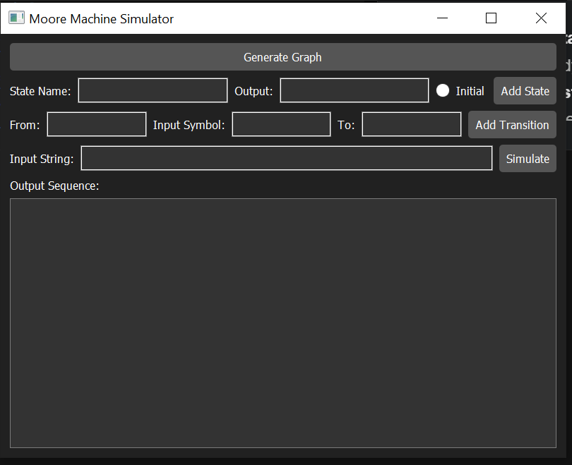
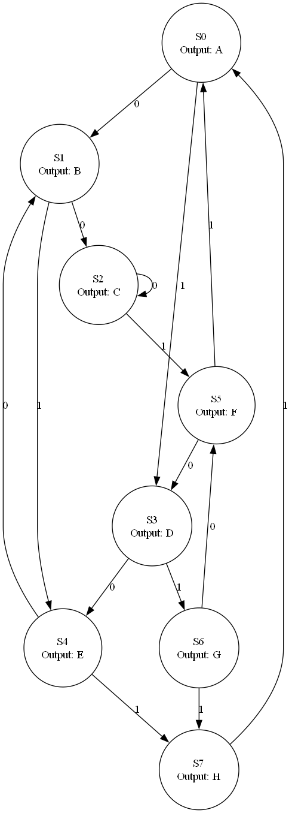

# Moore Machine Simulator

A Python-based simulator for **Moore and Mealy Machines** with a graphical interface built using **PyQt6**. This tool allows users to define finite-state machines, add states and transitions, simulate input strings, and visualize automata using **Graphviz**.

---

## Contributors 🙌

<span>
    <a href="https://www.github.com/ahmedyar7">
        
    </a>
    <a href="https://www.github.com/SameerTalreja">
        
    </a>
    <a href="https://www.github.com/AbulBasit">
        
    </a>
    <a href="https://www.github.com/">
        
    </a>
    <a href="https://github.com/DevStudent101-yk">
        
    </a>
</span>

---

## ✨ Features

- Define **states** with outputs (Moore) or **transitions with outputs** (Mealy)
- Set and update the **initial state**
- Add transitions dynamically via GUI
- Simulate **input strings** with step-by-step output
- Generate and visualize **state transition graphs**
- Switch between **Moore and Mealy** machine modes
- Clean, user-friendly GUI built using **PyQt6**
- Graph visualization powered by **Graphviz**

---

## 🛠️ Technologies Used

- **Python 3.10+**
- **PyQt6** – GUI framework
- **Graphviz** – Automata visualization
- **Qt Designer** (optional)
- **Object-Oriented Programming (OOP)**

---

## 🚀 Installation & Setup

### Prerequisites

- Python 3.10 or higher
- pip (Python package manager)
- Graphviz (installed and added to system PATH)

Download Graphviz from:
👉 [https://graphviz.org/download/](https://graphviz.org/download/)

---

### Step 1: Clone the Repository

```bash
git clone https://github.com/ahmedyar7/Moore-Machine-Simulator.git
cd Moore-Machine-Simulator
```

---

### Step 2: Create and Activate a Virtual Environment

```bash
# Windows
python -m venv venv
.\venv\Scripts\activate

# macOS / Linux
python3 -m venv venv
source venv/bin/activate
```

---

### Step 3: Install Dependencies

```bash
pip install -r requirements.txt
```

---

### Step 4: Run the Application

```bash
python main.py
```

The GUI will launch, allowing you to define and simulate Moore or Mealy machines.

---

## 📸 Screenshots

| Simulator UI                              | Graph Visualization                          |
| ----------------------------------------- | -------------------------------------------- |
|  |  |

---

## 🧠 How It Works

### Moore Machine

- Outputs are associated **with states**
- Example transition: `A --0--> B`
- Output depends on the **states visited**

### Mealy Machine

- Outputs are associated **with transitions**
- Example transition: `A --0/1--> B`
- Output depends on **input symbols and transitions**

---

## 🧪 Simulation Example (Moore Machine)

- **States**:
    - A (Output = 0)
    - B (Output = 1)

- **Initial State**: A
- **Transitions**:
    - A --0--> B
    - B --1--> A

- **Input**: `01`
- **Output**: `0 1 0`

---

## 📂 Project Structure

```
Moore-Machine-Simulator/
│
├── main.py                  # Application entry point
├── moore_machine.py         # Moore machine logic
├── mealy_machine.py         # Mealy machine logic
├── graph_generator.py       # Graphviz rendering logic
├── simulator_controller.py  # Core controller logic
├── ui_mainwindow.ui         # Qt Designer UI file
├── README.md
└── assets/
    └── imgs/
        └── image.png
```

---

## 👨‍💻 License

This project is licensed under the **MIT License**.
See the [LICENSE](./LICENSE) file for details.

---
